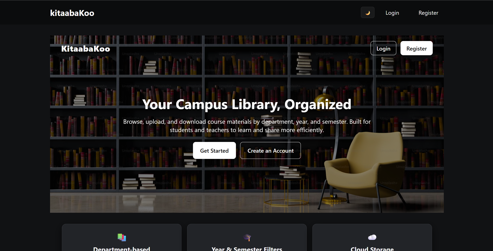
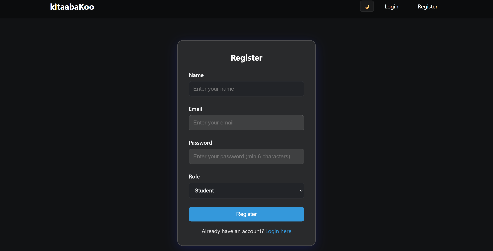
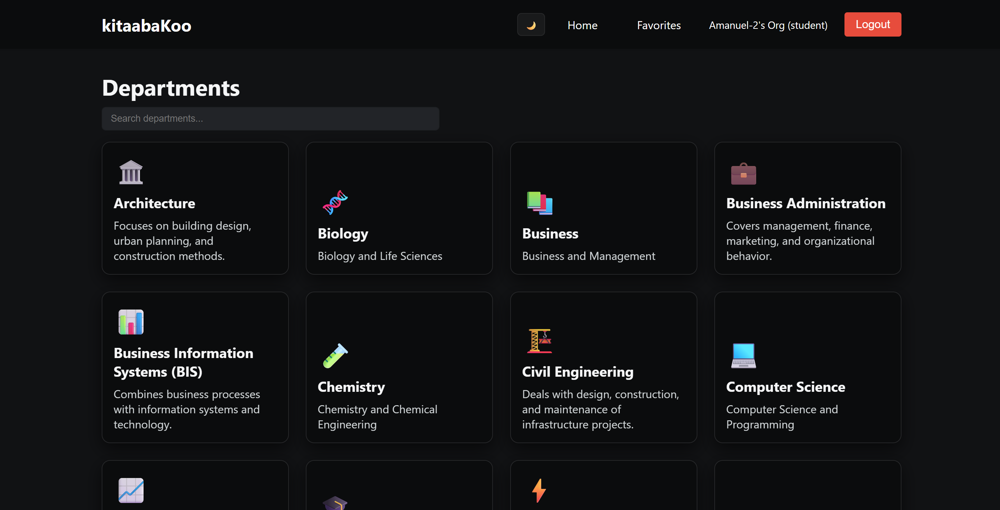

# University Library System - MERN Stack Application
<p align="center">
  <!-- 🖼️ Replace each image path below with your actual image files or URLs -->

  #### **Welcome Page**
  <br>

  #### **Register Page**
  <br>

  #### **After Login Page**
  <br>
</p>

A full-stack web application for managing a university library system with role-based access control. Teachers can upload books, and students can browse and download them.

## Features

- **Authentication**: JWT-based authentication with role-based access (Teacher/Student)
- **Department Management**: Organize books by departments (Computer Science, Literature, Engineering, etc.)
- **Book Upload**: Teachers can upload PDFs and documents to departments
- **Book Download**: Students can browse and download books
- **File Storage**: GridFS for storing large files in MongoDB
- **Responsive UI**: Clean and modern React interface

## Tech Stack

### Backend
- Node.js
- Express.js
- MongoDB with Mongoose
- GridFS for file storage
- JWT for authentication
- Multer for file uploads

### Frontend
- React 18
- React Router v6
- Axios for API calls
- Context API for state management

## Prerequisites

- Node.js (v14 or higher)
- MongoDB (local installation or MongoDB Atlas)
- npm or yarn

## Installation

### Backend Setup

1. Navigate to the backend directory:
```bash
cd Back-end
```

2. Install dependencies:
```bash
npm install
```

3. Create a `.env` file in the `Back-end` directory:
```env
PORT=5000
MONGODB_URI=mongodb://localhost:27017/university-library
JWT_SECRET=your-secret-key-change-this-in-production
NODE_ENV=development
```

4. Make sure MongoDB is running on your system.

5. Start the backend server:
```bash
npm start
# or for development with auto-reload:
npm run dev
```

The backend server will run on `http://localhost:5000`

### Frontend Setup

1. Navigate to the frontend directory:
```bash
cd Front-end
```

2. Install dependencies:
```bash
npm install
```

3. Create a `.env` file in the `Front-end` directory (optional, defaults to localhost:5000):
```env
REACT_APP_API_URL=http://localhost:5000/api
```

4. Start the frontend development server:
```bash
npm start
```

The frontend will run on `http://localhost:3000`

## Usage

### Registering Users

1. Navigate to the Register page
2. Fill in your details:
   - Name
   - Email
   - Password (minimum 6 characters)
   - Role (Teacher or Student)
3. Click Register

### As a Teacher

- Login with your teacher account
- Navigate to "Upload Book" from the navbar
- Fill in book details (title, author, department)
- Select a PDF or Word document file
- Click "Upload Book"
- You can also create new departments from the API or directly in MongoDB

### As a Student

- Login with your student account
- Browse departments on the homepage
- Click on a department to see available books
- Click "Download" to download any book

## API Endpoints

### Authentication
- `POST /api/auth/register` - Register a new user
- `POST /api/auth/login` - Login user
- `GET /api/auth/me` - Get current user (requires auth)

### Departments
- `GET /api/departments` - Get all departments
- `GET /api/departments/:id` - Get department with books
- `POST /api/departments` - Create department (teachers only)

### Books
- `GET /api/books` - Get all books (optional query: ?department=id)
- `GET /api/books/:id` - Get single book
- `POST /api/books` - Upload book (teachers only, multipart/form-data)
- `DELETE /api/books/:id` - Delete book (teachers only, own books)

### Files
- `GET /api/files/:fileId` - Download file (requires auth)

## Project Structure

```
kitaabaKoo/
├── Back-end/
│   ├── models/
│   │   ├── User.js
│   │   ├── Department.js
│   │   └── Book.js
│   ├── routes/
│   │   ├── auth.js
│   │   ├── departments.js
│   │   ├── books.js
│   │   └── files.js
│   ├── middleware/
│   │   └── auth.js
│   ├── server.js
│   └── package.json
├── Front-end/
│   ├── public/
│   ├── src/
│   │   ├── components/
│   │   ├── pages/
│   │   ├── context/
│   │   ├── services/
│   │   ├── App.js
│   │   └── index.js
│   └── package.json
└── README.md
```

## Security Features

- Password hashing with bcrypt
- JWT token-based authentication
- Role-based access control
- File type validation
- File size limits (50MB)

## Notes

- Make sure MongoDB is running before starting the backend
- For production, change the JWT_SECRET to a strong, random string
- Consider using environment variables for all sensitive data
- GridFS is used for file storage, which stores files in MongoDB chunks
- The application supports PDF and Word document formats

## Troubleshooting

### MongoDB Connection Error
- Ensure MongoDB is installed and running
- Check the MONGODB_URI in your `.env` file
- For MongoDB Atlas, use the connection string provided

### File Upload Issues
- Check file size (max 50MB)
- Ensure file is PDF or Word document format
- Verify GridFS is properly initialized

### CORS Errors
- Ensure backend CORS is configured correctly
- Check that frontend API URL matches backend URL

## License

This project is open source and available for educational purposes.

